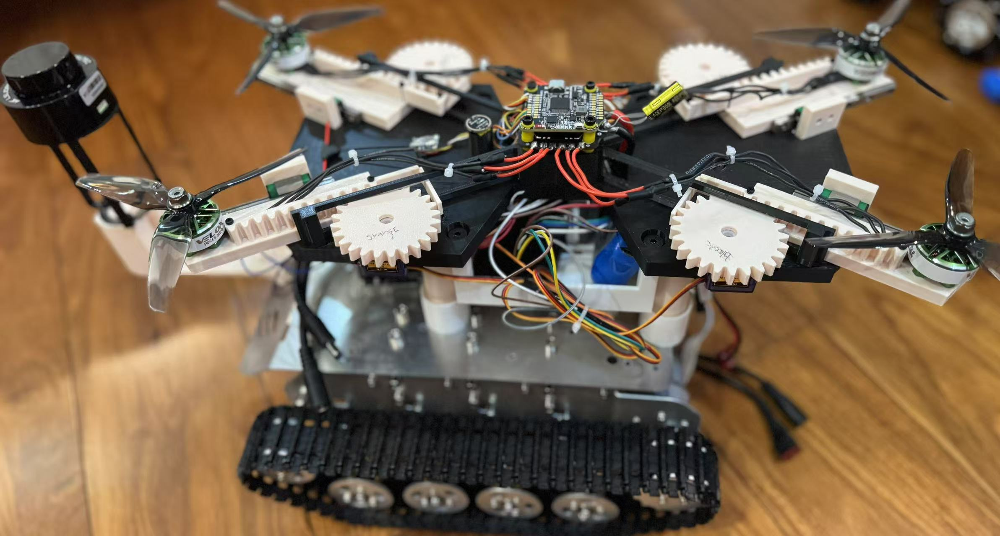

# Voice-Controlled Vehicle 
*(ESP32-S3 • Node.js • Deepgram • ChatGPT • Arduino UNO + TB6612)*


This repo contains **four coordinated codebases** that turn your spoken  
command (“forward”, “hover”, “stop”… ) into real wheels or propellers in ~1 s.

| Folder               | Language / Toolchain | Role |
|----------------------|----------------------|------|
| **`node-server/`**   | Node 18 + Express    | Accepts raw WAV, transcribes with **Deepgram**, rebroadcasts text via Socket.IO |
| **`java-client/`**   | Java 17 + Maven      | Sends text to **OpenAI GPT-4o**, chooses an action, emits control bytes over the same Socket.IO room |
| **`esp32-speech/`**  | Arduino-ESP32 core   | Captures mic via I²S, stores to SPIFFS, HTTP-POSTs `/uploadAudio` |
| **`arduino-motor/`** | Arduino UNO (AVR)    | Reads UART, drives TB6612 motors & four SG90 servo-rack arms |

Everything lives side-by-side, so you can **clone once** and build only the  
piece you care about.

---

## 0. Prerequisites

| Layer     | Requirements                    | Notes                                        |
|-----------|----------------------------------|----------------------------------------------|
| Node      | **Node ≥ 18**, npm ≥ 9          | `npm install` takes < 5 s                    |
| Java      | **JDK 17+**, Maven 3.8+         | VS Code “Extension Pack for Java” helps      |
| ESP32     | Arduino IDE 2.x / CLI / PIO     | Board: “ESP32-S3 Dev Module”                |
| UNO       | Arduino IDE 2.x                 | Board: “Arduino UNO”                         |
| Hardware  | INMP441 mic · TB6612 · 4× SG90  | Plus Bluetooth HC-05 pair                    |

### Secrets

Create `node-server/.env` from the template:

```bash
cp node-server/.env.example node-server/.env
````

`node-server/.env.example` should contain:

```env
DEEPGRAM_API_KEY=your_deepgram_api_key_here
PORT_HTTP=3000
PORT_SOCKET=3001

# Text-to-speech (60db) — see https://docs.60db.ai
TTS_PROVIDER=sixtydb
SIXTYDB_API_KEY=your_60db_api_key_here
SIXTYDB_BASE_URL=https://api.60db.ai
SIXTYDB_WS_URL=wss://api.60db.ai/ws/tts
SIXTYDB_VOICE_ID=
SIXTYDB_OUTPUT_FORMAT=mp3
```

> The Deepgram key is now read from `.env` (it used to be hard-coded in
> `server.js`). Copy `.env.example` to `.env` and fill in the real values;
> `.env` is git-ignored.

For the Java client, export your credentials like so:

```bash
export OPENAI_API_KEY=sk-XXXXXXXXXXXXXXXXXXXX
export NODE_SERVER_URL=http://localhost:3001
```

---

## 1. Quick Start

```bash
git clone https://github.com/Unieggy/voice-control-car.git
cd voice-control-car

# 1 — Start Node server
cd node-server
npm install
node server.js

# 2 — Start Java client
cd ../java-client
mvn clean package
mvn exec:java

# 3 — Upload ESP32 sketch
# Open esp32-speech/esp32speechtotext.ino in Arduino IDE
# Set board to "ESP32-S3 Dev Module" and upload

# 4 — Upload Arduino UNO sketch
# Open arduino-motor/MotorControl.ino in Arduino IDE
# Set board to "Arduino UNO" and upload
```

---

## 2. Detailed Setup

### 2-A. Node Server

```bash
cd node-server
npm install
node server.js
```

Runs the following:

* `POST /uploadAudio` on port `3000` — WAV in, Deepgram STT, returns motor command
* `POST /tts` on port `3000` — text in, **60db** audio out (see below)
* Socket.IO on port `3001`

#### Text-to-speech (`POST /tts`)

Synthesizes speech with **60db** behind a pluggable provider interface
(`nodejsserver/providers/tts/`). Three transports, selected per request via the
`transport` field:

| `transport`  | 60db endpoint        | Behaviour                                   |
| ------------ | -------------------- | ------------------------------------------- |
| `http` (def) | `POST /tts-synthesize` | One response, full clip                   |
| `stream`     | `POST /tts-stream`     | Chunked audio streamed as it is generated |
| `websocket`  | `wss /ws/tts`          | Incremental context, joined and returned  |

```bash
curl -X POST http://localhost:3000/tts \
  -H "Content-Type: application/json" \
  -d '{"text":"Moving forward","transport":"http","outputFormat":"mp3"}' \
  --output reply.mp3
```

Optional body fields (all fall back to `.env` defaults): `voiceId`,
`outputFormat` (`mp3`/`wav`/`ogg`/`flac`), `speed` (0.5–2.0),
`stability` (0–100), `similarity` (0–100), `enhance` (bool).

Swap providers by adding one to `providers/tts/index.js` and setting
`TTS_PROVIDER`; the rest of the app is unchanged.

### 2-B. Java Client

```bash
cd java-client
mvn clean package
mvn exec:java
```

Make sure these environment variables are set:

```bash
export OPENAI_API_KEY=your_key
export NODE_SERVER_URL=http://localhost:3001
```

### 2-C. ESP32 Firmware

* Board: **ESP32-S3 Dev Module**
* Edit `ssid`, `password`, and `serverHost` in `esp32speechtotext.ino`
* Upload using Arduino IDE
* Open serial monitor at **115200 baud**

### 2-D. Arduino UNO Firmware

* Board: **Arduino UNO**
* Edit motor pins in `MotorControl.ino` if needed
* Upload using Arduino IDE
* Serial baud rate: **115200**

**Serial Command Format:**

| Byte | Action   | Effect            |
| ---- | -------- | ----------------- |
| `F`  | Forward  | Move forward      |
| `B`  | Backward | Move backward     |
| `L`  | Left     | Pivot left        |
| `R`  | Right    | Pivot right       |
| `S`  | Stop     | Brake both motors |

---

## 3. Architecture Overview

```
Mic → ESP32-S3 → Node Server → Deepgram
                            ↓
                  Java GPT Client → Arduino UNO → Motors/Servos
```

All modules communicate over HTTP and Socket.IO.

---

## 4. Dev Tips

| Task                             | Command or Tool                          |
| -------------------------------- | ---------------------------------------- |
| Format Java code                 | `mvn fmt:format` (or VS Code Java tools) |
| Format Node code                 | `npx prettier --write .`                 |
| Test ESP32 mic                   | Watch `/recording.wav` upload status     |
| Verify server connection         | `curl http://localhost:3000`             |
| Monitor commands sent to Arduino | Use Serial Monitor @115200               |

---

## 5. Roadmap

* [ ] Add command-line interface for testing
* [ ] Add WebSocket dashboard to view transcripts
* [ ] Replace HC-05 with ESP-NOW for lower latency
* [ ] Add SLAM mode (RPLIDAR + micro-ROS)
* [ ] Auto-calibration for mic volume gain

---

## 6. Contributing

1. Fork the repo
2. Create a new branch: `git checkout -b feature/my-feature`
3. Commit your changes: `git commit -am 'Add some feature'`
4. Push to the branch: `git push origin feature/my-feature`
5. Submit a pull request

Please format code and test before submitting!

---

## 7. FAQ

### Why not run speech-to-text directly on the ESP32?

The ESP32-S3 doesn’t have enough RAM or processing power for real-time STT. We offload transcription to Deepgram’s cloud API.

### Can I run the server on a Raspberry Pi?

Yes, just install Node 18+ and Java 17+ with `nvm` and `sdkman`. Make sure your ESP32 can reach the Pi on the local network.

### Can I add new commands?

Yes. Edit the system prompt in the Java client, and update the parsing logic in both the Java code and Arduino motor controller.

---
